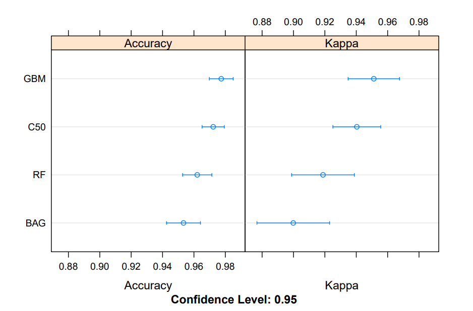
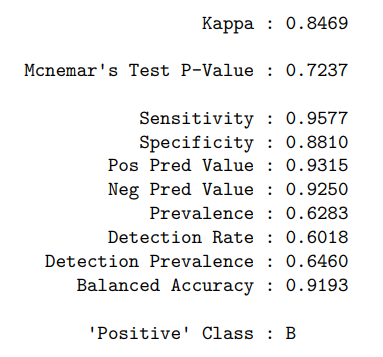

# Breast Cancer Wisconsin (Diagnostic) Data Set

## HarvardX - PH125.9x Data Science Professional Certificate

Breast cancer is a pathology in which a malignant tumor It develops in the breast tissue and is one of the
most common types of cancer, especially in women, more than 411,000 deaths annually worldwide.
The global incidence is thought to be more than 23.6 million new cases of cancer each year by 2030.
Mammography is used to detect breast cancer early, then proceed to the biopsy test with the “fine needle aspirates” (FNA) method that is the subject of this project, which is a safe method and accurate. 
After aspirating a drop of fluid into the breast mass, it is analyzed with the help of the miscroscope and photographed and analyzed with an “Xcyt” image analysis program, the edges of the nuclei are determined from initial points placed manually near these edges to then perform the interactive diagnostic process This project will train and evaluate the performance of several machine learning models that can predict the malignancy or not of a tumor, it is a binary classification problem where we will evaluate the accuracy,
sensitivity and specificity and thus to find the best model.

This is very useful since the diagnosis at an early stage facilitates the subsequent clinical management of patients and It can increase the survival rate of breast cancer patients.

