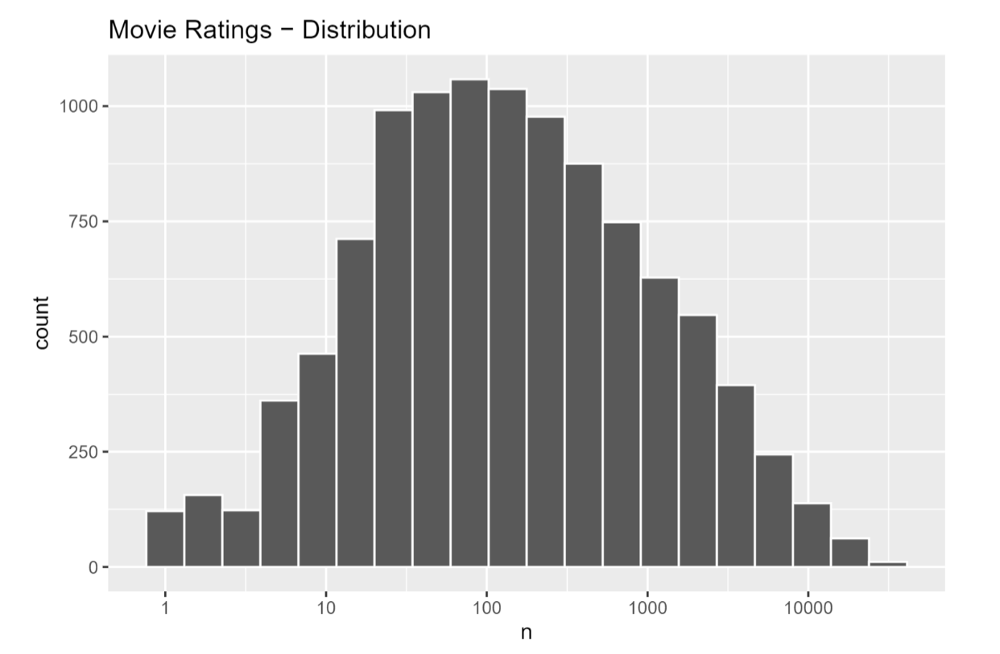
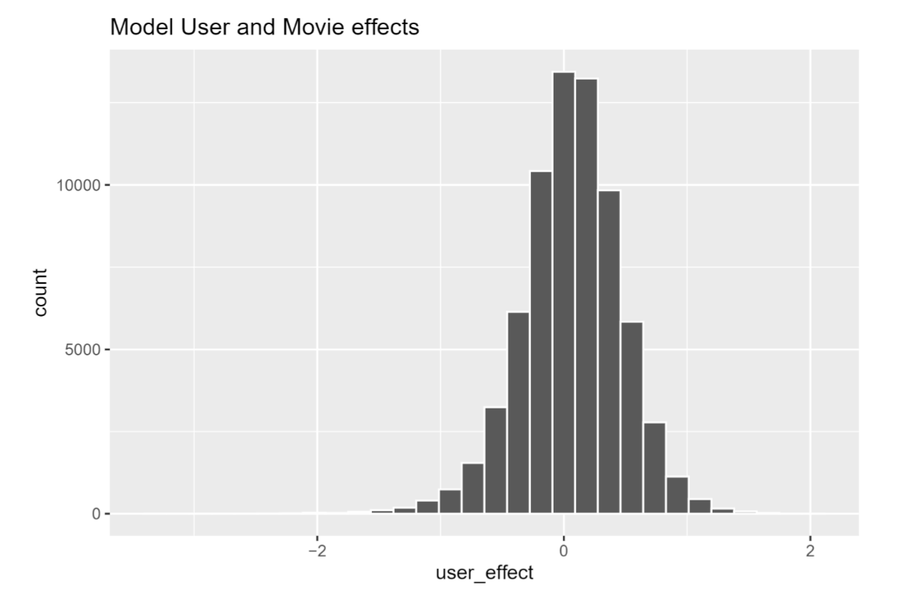
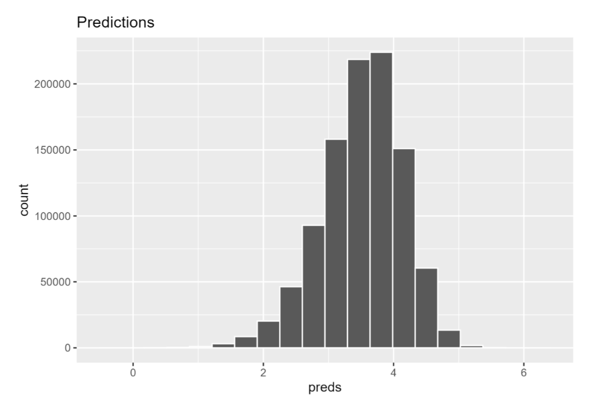
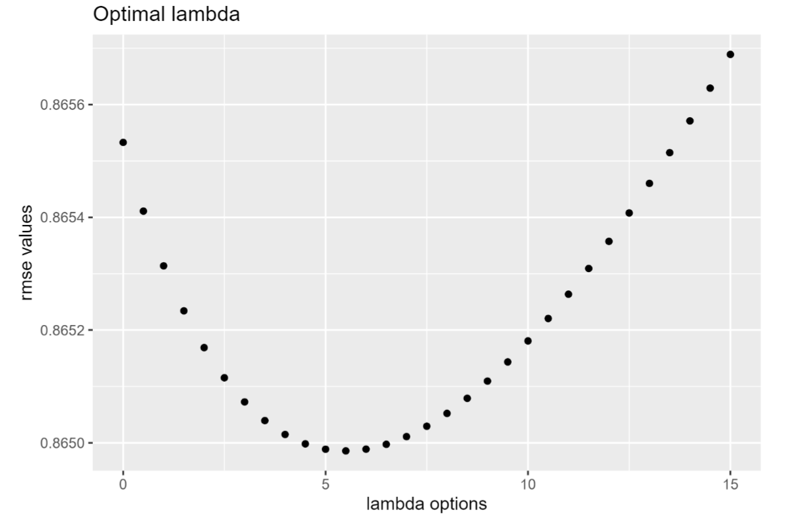
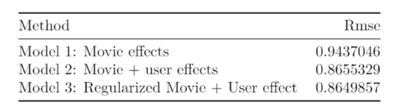

# Netflix Challenge

This analysis is based on the Netflix database that was the product of a challenge that was made in order to improve the movie recommendation system. The movie rating uses a rating range of 0 to 5. In the present project, it aims to train a machine learning algorithm that will use the inputs of a data set to predict movie ratings. Said data set can be downloaded from the following link:

http://files.grouplens.org/datasets/movielens/ml-10m.zip

For movie recommendation systems to work, they need user-made ratings, in the same way, when the goal is the sale of products, customers can rate the transaction and in this way the data for user training are supplied to the algorithms.In the case of Netflix, it uses a system to predict how many stars a user will give to a specific movie. When a movie's prediction gets a high rating, then it is recommended to other users.

There are different biases in movie ratings, such as movie genres and lack of ratings. To create machine learning models, these biases must be kept in mind.

For this project, the residual mean square error (RMSE) will be used, as Netflix did in its challenge.

